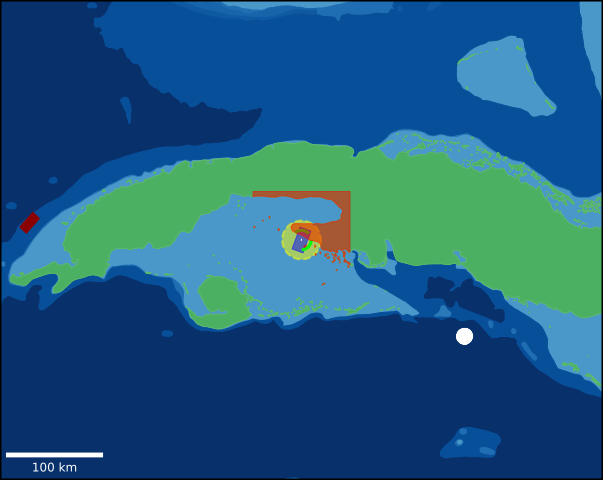

# SeaCharts Library - Version 4.0, User Documentation

> **Important**: Current version requires Conda environment setup. Pip installation support is planned for future releases.

## Table of Contents
1. [Initial Setup](#initial-setup)
2. [Configuration Setup](#configuration-setup)
3. [ENC Class for Maritime Spatial Data](#enc-class-for-maritime-spatial-data)
4. [Display Features](#display-features)
5. [Weather Visualization](#weather-visualization)
6. [Interactive Controls](#interactive-controls)
7. [Drawing Functions](#drawing-functions)
8. [Image Export](#image-export)
9. [AIS](#ais)

## Initial Setup

1. Clone the repository:
```bash
git clone https://github.com/meeqn/seacharts_s57
```

2. Set up the Conda environment:
   * Use the provided `conda_requirements.txt` file:
   ```bash
   conda create --name <envname> --file conda_requirements.txt
   conda activate <envname>
   ```

3. Set up directory structure:
   * **Windows users**: Use the provided `setup.ps1` PowerShell script
   * **Other platforms**: Manually create these directories:
     * `data`
     * `data/db`

4. Download map data:
   * Download the `US1GC09M` map from [here](https://www.charts.noaa.gov/ENCs/US1GC09M.zip)
   * Extract and place the `US1GC09M` directory (found in map's ENC_ROOT directory) inside `data/db` folder

5. Test the installation:
   * Run `test_seacharts_4_0.py`
   * Expected result is shown below




### Weather Module Setup (Optional)

If you need weather functionality:

```bash
git clone https://github.com/SanityRemnants/PyThor
cd PyThor
conda create --name <envname> --file requirements.txt
conda activate -n <envname>
python app.py
```

## Configuration Setup

### Configuration File Structure

The SeaCharts library is configured via `config.yaml` located in the seacharts directory (by default). Below are the detailed configuration options:

### ENC (Electronic Navigation Chart) Configuration

```yaml
enc:
  size: [width, height]        # Size of the chart in chosen CRS unit
  origin: [x, y]           # Origin coordinates in chosen CRS unit (excludes center)
  center: [x, y]           # Center point coordinates in chosen CRS unit (excludes origin)
  crs: "coordinate_system"     # Coordinate reference system
  S57_layers:                  # List of additional S-57 layers with display colors given in hex as value
    "LAYER_NAME": "#COLOR_IN_HEX"     # e.g., "TSSLPT": "#8B0000"
  resources: [data_paths]      # Path to ENC data root, is currently a list but expects one argument
```

#### Important Notes on ENC Configuration:
- `origin` and `center` are mutually exclusive - use only one
- For `CRS`, you can use:
  - "WGS84" for **latitude/longitude coordinates** (required for `S57 maps`)
  - "UTM" with zone and hemisphere, for **easting/northing coordinates** (e.g., "UTM33N" for UTM zone 33 North, used for `FGDB maps`)
- `S57_layers` field is **required** for S57 maps (can be empty list)
- Default S-57 layers (automatically included, dont need to be specified in `S57_layers` field):
  - `LNDARE` (Land)
  - `DEPARE` (Depth Areas)
  - `COALNE` (Coastline)
- The resources directory should contain path to **only one** map
- A useful S57 layer catalogue can be found at: https://www.teledynecaris.com/s-57/frames/S57catalog.htm

### Weather Configuration

```yaml
weather:
  PyThor_address: "http://127.0.0.1:5000"  # PyThor server address
  variables: [                              # Weather variables to display
    "wave_direction",
    "wave_height",
    "wave_period",
    "wind_direction",
    "wind_speed",
    "sea_current_speed",
    "sea_current_direction",
    "tide_height"
  ]
```

### Time Configuration

```yaml
time:
  time_start: "DD-MM-YYYY HH:MM"  # Start time (must match format exactly)
  time_end: "DD-MM-YYYY HH:MM"    # End time
  period: String                  # Time period unit
  period_multiplier: Integer      # Multiplier for time period
```

#### Time Configuration Notes:
- Valid period values:
  - "hour"
  - "day"
  - "week"
  - "month"
  - "year"
- Period multiplier works with hour, day, and week periods
- For example, for 2-hour intervals:
  - period: "hour"
  - period_multiplier: 2
- Month and year periods **don't support** multipliers

### Display Configuration

```yaml
display:
  colorbar: Boolean            # Enable/disable depth colorbar (default: False)
  dark_mode: Boolean           # Enable/disable dark mode (default: False)
  fullscreen: Boolean          # Enable/disable fullscreen mode (default: False)
  controls: Boolean            # Show/hide controls window (default: True)
  resolution: Integer          # Display resolution (default: 640)
  anchor: String               # Window position ("center", "top_left", etc.)
  dpi: Integer                # Display DPI (default: 96)
```

### PyThor Configuration
For Copernicus marine data access (sea currents and tides), configure PyThor:

```yaml
coppernicus_account:
  username: "your_username"    # Copernicus marine account username
  password: "your_password"    # Copernicus marine account password
resolution: float             # Output data resolution in degrees
```

## ENC Class for Maritime Spatial Data

> **Important API Note**: All SeaCharts API functions expect coordinates in **UTM CRS** (easting and northing), regardless of the CRS set in *config.yaml*.

The ENC class provides methods for handling and visualizing maritime spatial data, including reading, storing, and plotting from specified regions.

### Key Functionalities

* **Initialization**
    * The ENC object can be initialized with a path to a config.yaml file or a Config object.

* **Geometric Data Access**
    * The ENC provides attributes for accessing spatial layers:
        * `land`: Contains land shapes.
        * `shore`: Contains shorelines.
        * `seabed`: Contains bathymetric (seafloor) data by depth.

* **Coordinate and Depth Retrieval**
    * `get_depth_at_coord(easting, northing)`: Returns the depth at a specific coordinate.
    * `is_coord_in_layer(easting, northing, layer_name)`: Checks if a coordinate falls within a specified layer.

* **Visualization**
    * `display`: Returns a Display instance to visualize marine geometric data and vessels.

* **Spatial Data Update**
    * `update()`: Parses and updates ENC data from specified resources.

### Example Usage

```python
from seacharts import ENC

# Initialize ENC with configuration
enc = ENC("config.yaml")

# Get depth at specific UTM coordinates
depth = enc.get_depth_at_coord(easting, northing)

# Check if coordinates are in a specific layer (e.g., TSSLPT)
in_traffic_lane = enc.is_coord_in_layer(easting, northing, "TSSLPT")

# Add a vessel and display
display = enc.display
display.add_vessels((1, easting, northing, 45, "red"))
display.show()
```

## Display Features

The Display class provides various methods to control the visualization:

### Basic Display Controls

```python
display.start()              # Start the display
display.show(duration=0.0)   # Show display for specified duration (0 = indefinite)
display.close()              # Close the display window
```

### View Modes

```python
display.dark_mode(enabled=True)      # Toggle dark mode
display.fullscreen(enabled=True)     # Toggle fullscreen mode
display.colorbar(enabled=True)       # Toggle depth colorbar
```

### Plot Management

```python
display.redraw_plot()    # Redraw the entire plot
display.update_plot()    # Update only animated elements
```

## Weather Visualization

Weather data can be visualized using various variables:

* Wind (speed and direction)
* Waves (height, direction, period)
* Sea currents (speed and direction)
* Tide height

The visualization type is automatically selected based on the variable:

* Scalar values: displayed as heatmaps
* Vector values: displayed as arrow maps with direction indicators

## Interactive Controls

When `controls: True` in the config, a control panel provides:

* **Time Slider**
    * Allows navigation through different timestamps with labels for date and time.
* **Layer Selection**
    * Includes radio buttons to select weather variables such as wind, waves, and sea current.

## Drawing Functions

The Display class offers various drawing functions for maritime shapes:

### Vessel Management

```python
display.add_vessels(*vessels)     # Add vessels to display
# vessels format: (id, x, y, heading, color)
display.clear_vessels()           # Remove all vessels
```

### Shape Drawing

#### Lines

```python
display.draw_line(
    points=[(x1,y1), ...],   # List of coordinate pairs
    color="color_string",     # Line color
    width=float,             # Optional: line width
    thickness=float,         # Optional: line thickness
    edge_style=str|tuple,    # Optional: line style
    marker_type=str          # Optional: point marker style
)
```
#### Circles

```python
display.draw_circle(
    center=(x, y),           # Center coordinates
    radius=float,            # Circle radius
    color="color_string",    # Circle color
    fill=Boolean,            # Optional: fill circle (default: True)
    thickness=float,         # Optional: line thickness
    edge_style=str|tuple,    # Optional: line style
    alpha=float             # Optional: transparency (0-1)
)
```

#### Rectangles

```python
display.draw_rectangle(
    center=(x, y),           # Center coordinates
    size=(width, height),    # Rectangle dimensions
    color="color_string",    # Rectangle color
    rotation=float,          # Optional: rotation in degrees
    fill=Boolean,            # Optional: fill rectangle (default: True)
    thickness=float,         # Optional: line thickness
    edge_style=str|tuple,    # Optional: line style
    alpha=float              # Optional: transparency (0-1)
)
```

#### Polygons

```python
display.draw_polygon(
    geometry=shape_geometry,  # Shapely geometry or coordinate list
    color="color_string",     # Polygon color
    interiors=[[coords]],     # Optional: interior polygon coordinates
    fill=Boolean,             # Optional: fill polygon (default: True)
    thickness=float,          # Optional: line thickness
    edge_style=str|tuple,     # Optional: line style
    alpha=float              # Optional: transparency (0-1)
)
```

#### Arrows

```python
display.draw_arrow(
    start=(x1, y1),           # Start coordinates
    end=(x2, y2),             # End coordinates
    color="color_string",      # Arrow color
    width=float,              # Optional: line width
    fill=Boolean,             # Optional: fill arrow (default: False)
    head_size=float,          # Optional: arrow head size
    thickness=float,          # Optional: line thickness
    edge_style=str|tuple      # Optional: line style
)
```

## Image Export

The `save_image` function allows you to export the current display or plot as an image file. This function offers several customizable options for setting the file name, location, resolution, and file format. It wraps around the internal `_save_figure` method, which handles the actual saving and setting of default values when specific parameters are not provided.

### Usage

```python
display.save_image(
    name=str,               # Optional: output filename (default: current window title)
    path=Path,              # Optional: output directory path (default: "reports/")
    scale=float,            # Optional: resolution scaling factor (default: 1.0)
    extension=str           # Optional: file format extension (default: "png")
)
```

## AIS
AIS module provides a support for displaying historical and live (provided through HTTP NMEA stream) vessels data. 

The module can be configured inside the `config.yaml`. The module has to be included inside the `enc` block (description provided [here](#enc-electronic-navigation-chart-configuration)).
Configuration options are described [here](#ais-configuration).

### AIS live mode

**Requirements**:
-  continuous HTTP AIS data stream in NMEA 0183 format
- [Time configuration block](#time-configuration)

The AIS live module is based on retrieving data from a continuous HTTP AIS data stream in
NMEA 0183 format. 

The time configuration block is required to define a time-to-live for the AIS data. Based on the `period` value, the old data, that has not been updated for the specified period, will be removed from the memory of the application (e.g. if the period is set to `hour`, the data that has not been updated for the last hour will be removed).

Example live mode configuration:
```yaml
enc:
  time:
    #...
    period: "hour"
  #...
  ais:
    module: "live" 
    address: 123.456.0.000
    port: 0000
    interval: 10
    #...
```

### AIS database mode

**Requirements**:
- Database file in SQLite3 format with 4 columns that corresponds to: `mmsi`, `lon`, `lat`, `last_updated` (more information [here](#db_fields))
- Table with name 'AISHistory' (Temporary solution)
- [Time configuration block](#time-configuration)

The AIS database module is based on retrieving data from a SQLite3 database file. The module is designed to work with data provided in the database in the form of a table. The table must contain columns corresponding to the variables listed in the [`db_fields`](#db_fields) parameter description. For variables types, please refer to *PyAIS* documentation [here](https://pyais.readthedocs.io/en/latest/messages.html#nmea-messages).

The time block configuration allows user to pick a fixed point in time from a time slider, based on which the data will be displayed. The `period` parameter defines the range of single picked time point, e.g. if the `period` is set to `hour` and the time point is set to `01-01-2022 12:00`, the closest data to this time point will be displayed, but not older than 1 hour (`01-01-2022 11:00`).

Example database mode configuration:
```yaml
enc:
  time:
    #...
    time_start: "01-01-2022 00:00"
    time_end: "01-01-2022 01:00"
    period: "hour"
  #...
  ais:
    module: "db" 
    connection_string: "path/to/database.db"
    coords_type: "utm"
    #...
```

### AIS configuration

```yaml
enc:
  #...
  ais:
    module: "module" 
    address:
    port: 0000
    interval: 0
    connection_string: "conn_str"
    coords_type: "coords_type"
    static_info: true
    scale: 0
    dynamic_scale: true
    db_fields: 
      "KEY":"VALUE"
    colors: 
      "KEY":"VALUE"
    
```
## Parameters options
### ais
- Type: none

Begins the configuration block of AIS module. Inside the `enc` block.

---
### module
- Type: `string`
- Possible values: `live`, `db`

Specifies the AIS data source mode.

---

### AIS Live mode parameters

### address
- Type: `string`

Network address of the live AIS stream

---
### port
- Type: `int`

Port number for the AIS stream.

---
### interval
- Type: `int`

Fetch new data every `interval` seconds.

---

### AIS database mode parameters
### connection_string
- Type: `string`

Connection string for the AIS data source.

---
### coords_type
- Type: `string`
- Possible values: `utm`, `lonlat`

Defines the coordinate format of the AIS data in the database.

---

### db_fields
- Type: `dictionary`

Maps custom column names to corresponding variables.

The database mode require 4 columns that corresponds to: `mmsi`, `lon`, `lat`, `last_updated`. Their names can be customized using this parameter.

Example:
```yaml
enc:
#...
  ais:
  ###
    db_fields:
      "lon":"longtitude"
      "color":"colour"
```
Such configuration would expect the database table to contain 5 columns: `mmsi`, `longtitude`, `lat`, `last_updated`, `colour`.


Supported variables:
`mmsi`,
`lon`,
`lat`,
`turn`,
`ship_type`,
`last_updated`,
`name`,
`ais_version`,
`ais_type`,
`status`,
`course`,
`speed`,
`heading`,
`imo`,
`callsign`,
`shipname`,
`to_bow`,
`to_stern`,
`to_port`,
`to_starboard`,
`destination`,
`color`

For variables types, please refer to *PyAIS* documentation [here](https://pyais.readthedocs.io/en/latest/messages.html#nmea-messages). 

The `color` variable is an additional variable, used to assign a custom color to the vessel polygon. 
The expected values for `color` are the keys in the [`colors`](#colors) variable, e.g., DEFAULT, CARGO, etc.

---

### Additional parameters
### static_info
- Type: `boolean`

Displays additional window with static inforamtion related to the vessels.

---
### scale
- Type: `int`

Multiplies the scale of every polygon on the chart by the provided value.

---
### dynamic_scale
- Type: `boolean`

Dynamically scales the vessels polygons based on the AIS message data. 

For live mode, the vessels will be scaled as soon as `to_port`, `to_stern`, `to_starboard` `to_bow` variables will be available in upcoming AIS message.

For database mode, the table must contain columns corresponding to the variables listed above.

---

### colors
- Type: `dictionary`

Assigns custom vessel color in hex format, to ship type, based on types provided in https://api.vtexplorer.com/docs/ref-aistypes.html.
Additionaly, for vessels with no information about it's tpe, the `DEFAULT` key is supported.
Example:
```yaml
enc:
#...
  ais:
  ###
    colors:
      "DEFAULT":"#000000"
      "CARGO":"#FFFFFF"
```
Above configuration would display vessels with no provided type as black polygons. The cargo vessels will be displayed as white polygons.

Supported variables:

`DEFAULT`, `WIG`,     `FISHING`,         `TOWING`,`TOWING_EXCEED`,    `DREDGING_UNDERWATER`,`DIVING_OPS`,`MILITARY_OPS`,     `SAILING`,   `PLEASURE_CRAFT`,   `HSC`, `HSC_A`,            `HSC_B`,          `HSC_C`,          `HSC_D`,          `PILOT`,          `RESCUE`,          `TUG`,         `PORT_TENDER`,      `ANTI_POLLUTION_EQ`,`LAW_ENFORCEMENT`,`LOCAL_VESSEL`,`MEDICAL_TRANSPORT`,`NONCOMBATANT`,`PASSENGER`,   `PASSENGER_A`,      `PASSENGER_B`,    `PASSENGER_C`,    `PASSENGER_D`,    `CARGO`,    `CARGO_A`,          `CARGO_B`,        `CARGO_C`,        `CARGO_D`,        `TANKER`,        `TANKER_A`,         `TANKER_B`,       `TANKER_C`,       `TANKER_D`,       `OTHER`,       `OTHER_A`,          `OTHER_B`,        `OTHER_C`,        `OTHER_D`,        

If no colors are provided, the vessels will use the following colors:

```yaml
DEFAULT: "#CCCCCC"
WIG: "#FF5733"
FISHING: "#FF8C00"
TOWING: "#FFD700"
TOWING_EXCEED: "#FF4500"
DREDGING_UNDERWATER: "#8A2BE2"
DIVING_OPS: "#4682B4"
MILITARY_OPS: "#696969"
SAILING: "#00FF7F"
PLEASURE_CRAFT: "#FF69B4"
HSC: "#4B0082"
HSC_A: "#800080"
HSC_B: "#9370DB"
HSC_C: "#8B0000"
HSC_D: "#B22222"
PILOT: "#00008B"
RESCUE: "#FF0000"
TUG: "#D2691E"
PORT_TENDER: "#8B4513"
ANTI_POLLUTION_EQ: "#20B2AA"
LAW_ENFORCEMENT: "#000080"
LOCAL_VESSEL: "#32CD32"
MEDICAL_TRANSPORT: "#FF6347"
NONCOMBATANT: "#778899"
PASSENGER: "#1E90FF"
PASSENGER_A: "#00CED1"
PASSENGER_B: "#40E0D0"
PASSENGER_C: "#4682B4"
PASSENGER_D: "#5F9EA0"
CARGO: "#DAA520"
CARGO_A: "#B8860B"
CARGO_B: "#CD853F"
CARGO_C: "#D2B48C"
CARGO_D: "#A0522D"
TANKER: "#FFFF00"
TANKER_A: "#FF4500"
TANKER_B: "#FF6347"
TANKER_C: "#FFA07A"
TANKER_D: "#FA8072"
OTHER: "#696969"
OTHER_A: "#708090"
OTHER_B: "#778899"
OTHER_C: "#A9A9A9"
OTHER_D: "#D3D3D3"
```

---

### Additional information
The AIS module collides with vessels added through [`add_vessel`](#vessel-management) method and will be be overwritten by vessels provided through AIS module.


## End note
We recommend checking out files placed in `tests` directory as reference, to get familiar with the SeaCharts usage.
